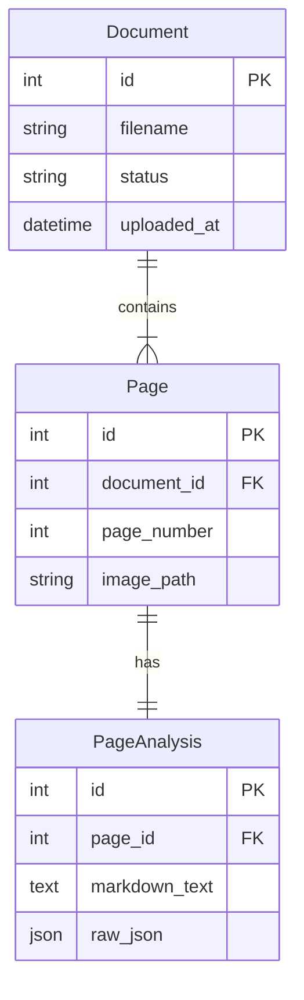

# PDF Vision Processor - Architecture Documentation

## 1. System Overview

The PDF Vision Processor is a web application designed to ingest PDF documents, convert them into images, and utilize a Vision Large Language Model (LLM) to extract structured content and layout information. The system provides a user interface for uploading documents and visualizing the analysis results, including bounding box overlays for detected elements.

## 2. Technology Stack

*   **Backend Framework**: FastAPI (Python 3.12)
*   **Database**: SQLite
*   **ORM**: SQLAlchemy
*   **PDF Processing**: PyMuPDF (fitz)
*   **AI/ML**: OpenAI-compatible Vision API (e.g., GPT-4o)
*   **Frontend**: Server-side rendered HTML (Jinja2) + Bootstrap 5 + Vanilla JavaScript
*   **Task Management**: FastAPI BackgroundTasks (Async)

## 3. System Components

### 3.1 API Layer (`app/routes.py`, `app/main.py`)
The entry point for the application. It exposes REST endpoints for:
*   File Upload (`POST /upload`)
*   Processing Triggers (`POST /process/{id}`)
*   Data Retrieval (`GET /documents`, `GET /pages/...`)
*   Serving UI Templates and Static Files.

### 3.2 Processing Engine (`app/processor.py`)
Handles the core business logic:
1.  **PDF Conversion**: Converts PDF pages to PNG images using PyMuPDF.
2.  **Image Encoding**: Encodes images to Base64 for API transmission.
3.  **LLM Interaction**: Constructs prompts and sends requests to the Vision API.
4.  **Result Parsing**: Parses the JSON response from the LLM containing Markdown text and bounding box coordinates.

### 3.3 Database Layer (`app/models.py`, `app/database.py`)
Manages persistent storage using SQLite.
*   **Document**: Stores metadata about the uploaded file and overall processing status.
*   **Page**: Represents a single page of a document, linked to the generated image file.
*   **PageAnalysis**: Stores the raw JSON response and extracted Markdown from the LLM.

### 3.4 User Interface (`app/templates/`, `app/static/`)
*   **List View**: Displays uploaded documents and their status.
*   **Detail View**: A split-pane interface.
    *   **Left**: Renders the page image. JavaScript overlays `<div>` elements for bounding boxes based on the API response.
    *   **Right**: Displays the extracted Markdown text.

## 4. Data Flow

1.  **Upload**: User uploads a PDF -> Saved to `data/uploads` -> `Document` record created (Status: PENDING).
2.  **Process Trigger**: User clicks "Process" -> Request sent to `POST /process/{id}` -> Background task started.
3.  **Processing Pipeline**:
    *   PDF split into images (saved to `data/images/{id}/`).
    *   `Page` records created.
    *   For each page:
        *   Image sent to Vision LLM.
        *   Response (Markdown + JSON) saved to `PageAnalysis`.
    *   Document status updated to COMPLETED.
4.  **Visualization**:
    *   User opens Document View.
    *   Frontend fetches Page Image and Analysis Data.
    *   JS renders image and draws bounding boxes over it.

## 5. Database Schema



## 6. Directory Structure

```
pdf_vision_processor/
├── app/
│   ├── __init__.py
│   ├── main.py           # App entry point
│   ├── models.py         # DB Models
│   ├── schemas.py        # Pydantic Schemas
│   ├── routes.py         # API Endpoints
│   ├── processor.py      # Core Logic
│   ├── database.py       # DB Connection
│   ├── templates/        # HTML Templates
│   └── static/           # CSS/JS
├── data/                 # Storage for PDFs and Images
├── docs/                 # Documentation
├── requirements.txt
└── README.md
```
